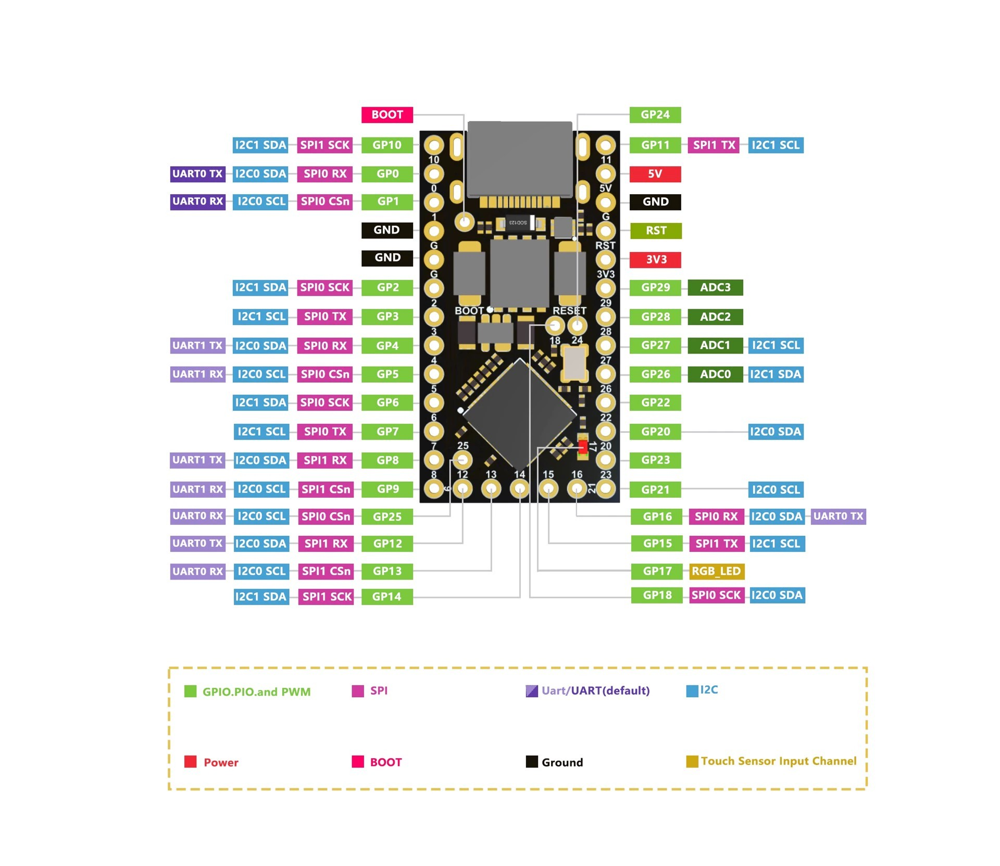

# lily58 2040 firmware

更好用的 Lily58 固件——

## 特性

- 主控使用 rp2040，配置更高，性能更好，更便宜
- 支持 Vial，QMK 功能丰富，可以自己修改代码开启更多
- 兼容 [Lily58](https://github.com/kata0510/Lily58) 和 [Lily58-RE](https://github.com/kissetfall/Lily58-Pro-RE)

## 使用

```
 cd vial-qmk/keyboards/
 git clone https://github.com/jing2uo/lily58-2040-fw.git lily58_2040
 cd ../    # 位于 vial-qmk 目录下

 make lily58_2040/rp:vial:uf2-split-left   # 编译左手
 make lily58_2040/rp:vial:uf2-split-right  # 编译右手
```

## 2040 GPIO



欢迎提 pr 增加更多功能～
